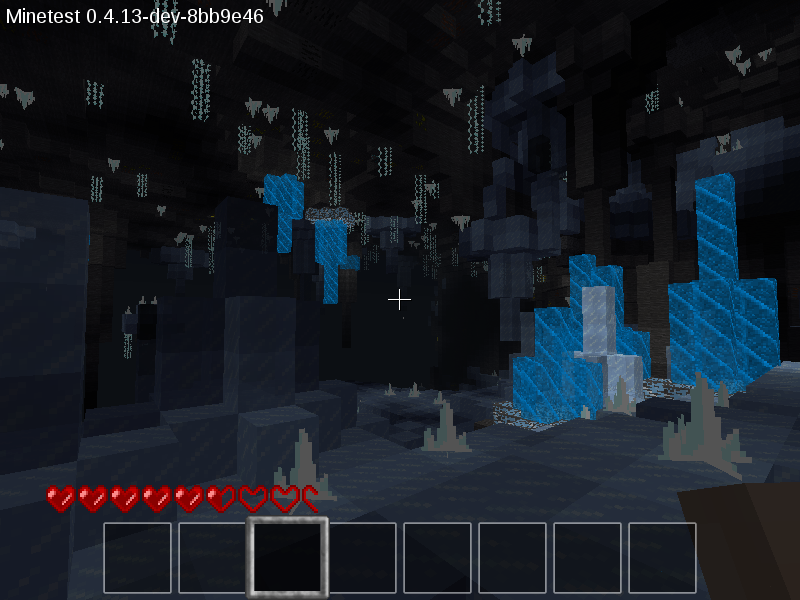
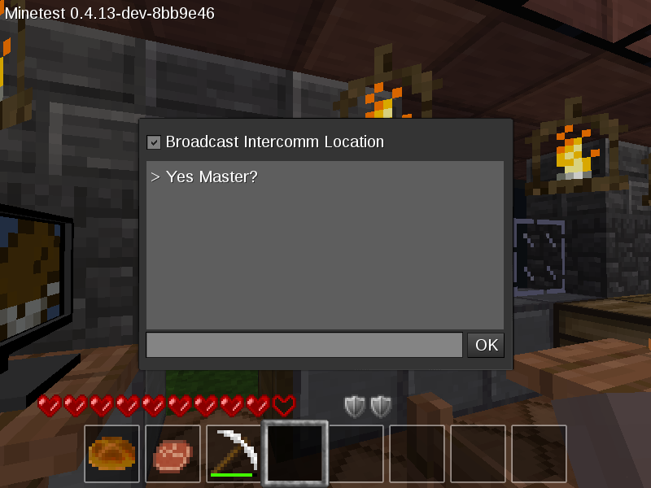
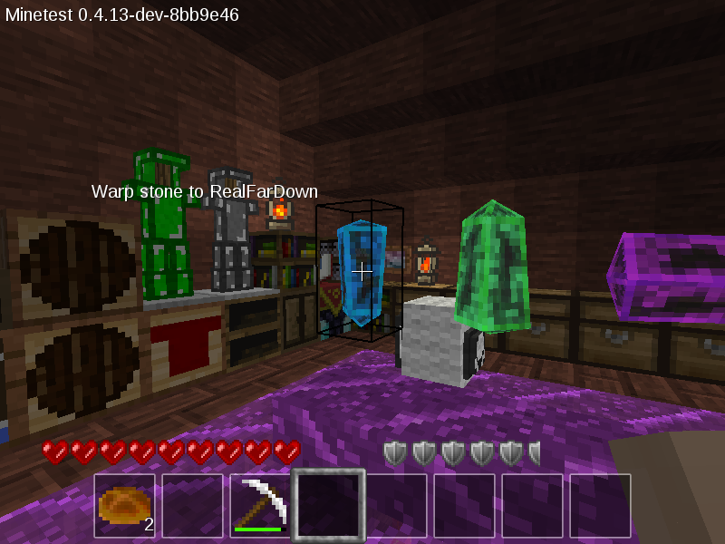

# dcb - A Minetest Subgame

Download this subgame either via git:

	git clone --recurse-submodules https://github.com/everamzah/dcb

or via the download button as a ZIP file ; unpack the ZIP to your `minetest/games` folder.

### Author, Updates

DCB was originally developed by @everamzah , who has since taken a hiatus from the Internet at large. Please report bugs into the current main host repository at [taikedz/everamzah-dcb](https://github.com/taikedz/everamzah-dcb) to request fixes / suggest changes.

# DCB

Forum Page for the Sub Game: [https://forum.minetest.net/viewtopic.php?f=50&t=12968](https://forum.minetest.net/viewtopic.php?f=50&t=12968)

# Screenshots

